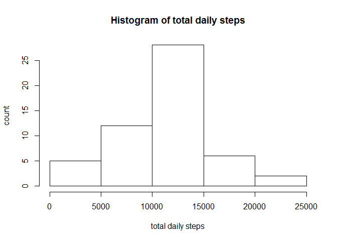
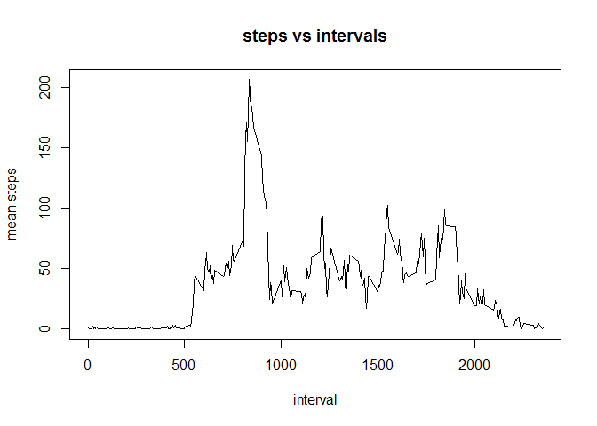
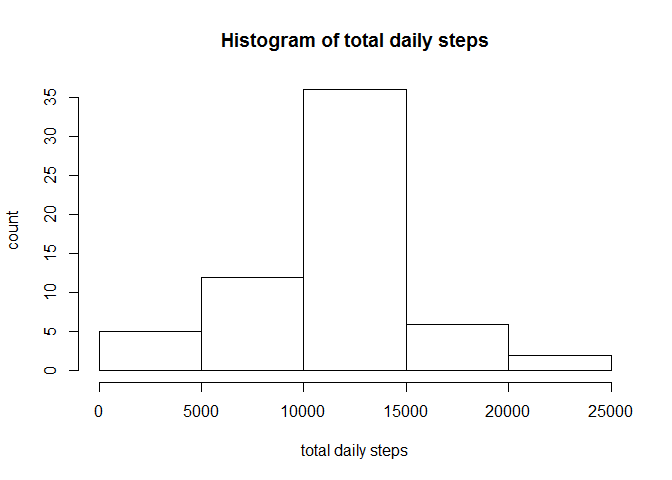
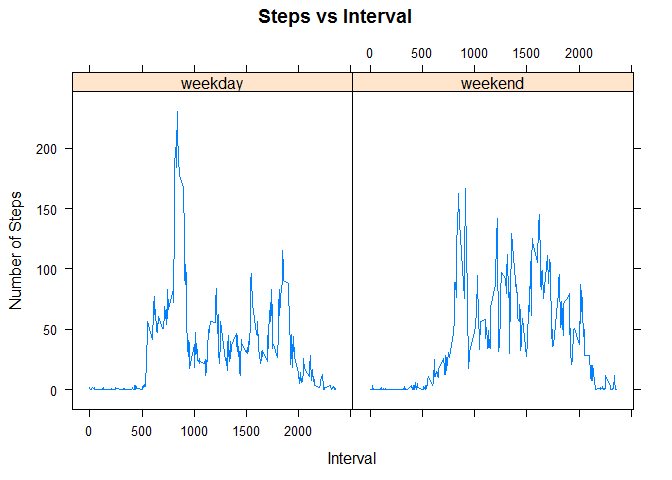

# Reproducible Research: Peer Assessment 1
Kumar Aiyer  
Saturday, March 14, 2015  

## Executive Summary

In this report we explore how to analyze a typical fitness dataset with missing data. We introduce an algorithm to backfill missing data and then answer some key questions on activity for an entire day. Our analysis shows that the average number of total steps taken in a day is 10766 steps. The median (50th percentile) of the total number of steps taken in a day is 10765 steps. With the backfilled data, the mean of the total daily steps is 10766 and the median is also 10766. The mean is the same as the original data set and the median is higher by 1 compared to the original data set. Finally on a typical weekend day, a subject covered 12201 steps versus 10255 steps on a weekday, showing more active lifestyle on a typical weekend.

## Loading and preprocessing the data

We load the data from the zip file and convert the dates to Posix time format. Next, we perform data cleaning and remove the rows having NA's for steps in the data frame.


```r
# loading libraries
library(dplyr)
```

```
## 
## Attaching package: 'dplyr'
## 
## The following object is masked from 'package:stats':
## 
##     filter
## 
## The following objects are masked from 'package:base':
## 
##     intersect, setdiff, setequal, union
```

```r
library(ggplot2)
library(lattice)
library(foreach)
# load data
data <- read.table(unz("activity.zip", "activity.csv"), nrows=17570, header=T, quote="\"", sep=",")
data$date <- as.Date(data$date)

# drop the NA's
data.df <- data[!is.na(data$steps),]
# summary
summary(data)
```

```
##      steps             date               interval     
##  Min.   :  0.00   Min.   :2012-10-01   Min.   :   0.0  
##  1st Qu.:  0.00   1st Qu.:2012-10-16   1st Qu.: 588.8  
##  Median :  0.00   Median :2012-10-31   Median :1177.5  
##  Mean   : 37.38   Mean   :2012-10-31   Mean   :1177.5  
##  3rd Qu.: 12.00   3rd Qu.:2012-11-15   3rd Qu.:1766.2  
##  Max.   :806.00   Max.   :2012-11-30   Max.   :2355.0  
##  NA's   :2304
```

```r
summary(data.df)
```

```
##      steps             date               interval     
##  Min.   :  0.00   Min.   :2012-10-02   Min.   :   0.0  
##  1st Qu.:  0.00   1st Qu.:2012-10-16   1st Qu.: 588.8  
##  Median :  0.00   Median :2012-10-29   Median :1177.5  
##  Mean   : 37.38   Mean   :2012-10-30   Mean   :1177.5  
##  3rd Qu.: 12.00   3rd Qu.:2012-11-16   3rd Qu.:1766.2  
##  Max.   :806.00   Max.   :2012-11-29   Max.   :2355.0
```
The summary on the two data sets shows that the NA's have been cleaned.


## What is mean total number of steps taken per day?

We use the dplyr package to create an aggregation of steps over the period of an entire day by summing over all the 5 minute step intervals in a entire day for each date in the data set. We then plot a historgram to see the pattern of the distribution and the compute the mean and median of the distribution. We then use the summarise function to compute the mean and median number of daily steps for this data set. Our analysis shows that the average number of total steps taken in a day is 10766 steps. The median (50th percentile) of the total number of steps taken in a day is 10765 steps.


```r
# apply group_by and compute daily total steps
by_date.df <- group_by(data.df, date)
by_date.summary <- summarise(by_date.df, totsteps=sum(steps),nr=length(interval))
# plot histogram of ata
hist(by_date.summary$totsteps,main="Histogram of total daily steps", xlab="total daily steps", ylab="count")
```

 

```r
# mean and median of daily total steps
all_data.summary <- summarise(by_date.summary, mean.steps = mean(totsteps),median.steps=median(totsteps))
all_data.summary
```

```
## Source: local data frame [1 x 2]
## 
##   mean.steps median.steps
## 1   10766.19        10765
```

## What is the average daily activity pattern?

We now shift the focus to the average daily activity pattern. Instead of aggregating over the 5 minute intervals of a given day, we aggregate over all dates in the data set for each interval of the day. We then plot the time series. The 835th minute (or 168th 5-minute interval ) interval, on average across all the days in the dataset, contains the maximum number of steps of 206.


```r
# now create dataframe for daily activity pattern and plot it
by_interval.df <- group_by(data.df, interval)
by_interval.summary <- summarise(by_interval.df, mean.steps=mean(steps))
plot(by_interval.summary$interval,by_interval.summary$mean.steps, type='l', main="steps vs intervals", xlab= "interval" , ylab="mean steps")
```

 

```r
# find the max value of steps during the day and then find the interval at which it occurs
maxsteps <- max(by_interval.summary$mean.steps)
maxsteps
```

```
## [1] 206.1698
```

```r
maxinterval <- by_interval.summary[by_interval.summary$mean.steps==maxsteps,]$interval
maxinterval
```

```
## [1] 835
```

```r
intervalnum <- maxinterval/5 + 1
intervalnum
```

```
## [1] 168
```

## Imputing missing values

We now shift our efforts to develop an algorithm to backfill the missing values in the data set. We find that there are 2304 missing values for step data in the dataset.
The simplest algorithm that will maintain the overall mean number of total steps for a day is to use the mean for each interval aggregated across dates to backfill the dataset. The mean of the total daily steps is 10766 and the median is also 10766. The mean is the same as the original data set and the median is higher by 1 compared to the original data set.


```r
# find number of NA's
summary(data)
```

```
##      steps             date               interval     
##  Min.   :  0.00   Min.   :2012-10-01   Min.   :   0.0  
##  1st Qu.:  0.00   1st Qu.:2012-10-16   1st Qu.: 588.8  
##  Median :  0.00   Median :2012-10-31   Median :1177.5  
##  Mean   : 37.38   Mean   :2012-10-31   Mean   :1177.5  
##  3rd Qu.: 12.00   3rd Qu.:2012-11-15   3rd Qu.:1766.2  
##  Max.   :806.00   Max.   :2012-11-30   Max.   :2355.0  
##  NA's   :2304
```

```r
na.df <- data[is.na(data$steps),]
# now backfill NA's with mean of by_interval.df
interval2steps <- function(interval) {
  by_interval.summary[by_interval.summary$interval==interval,]$mean.steps
}
backfill_na <- function(interval) {
  na.df[na.df$interval==interval,]$steps <<- interval2steps(interval)
  0
}
intervals.df <- unique(by_interval.df$interval)
```


```r
foreach(i=1:length(intervals.df)) %do% backfill_na(intervals.df[i])
backfilled.df <- rbind(na.df, data.df)
```

```r
# now create a table by date
backfilled_by_date.df <- group_by(backfilled.df, date)
backfilled_by_date.summary <- summarise(backfilled_by_date.df, totsteps=sum(steps),nr=length(interval))
# plot histogram of data
hist(backfilled_by_date.summary$totsteps,main="Histogram of total daily steps",xlab="total daily steps", ylab="count")
```

 

```r
# mean and median of daily total steps
backfilled_all_data.summary <- summarise(backfilled_by_date.summary, mean.steps = mean(totsteps),median.steps=median(totsteps))
backfilled_all_data.summary
```

Source: local data frame [1 x 2]

  mean.steps median.steps
1   10766.19     10766.19

## Are there differences in activity patterns between weekdays and weekends?

We now analyze the famous "couch potato" effect in exercise activity. Do people take more steps on weekdays or weekends? On a typical weekend day, a subject covered 12201 steps versus 10255 steps on a weekday. If you look at the pattern of activity, assuming most subjects work in office settings, the graph shows a more subdued steps pattern for most of a typical weekday with a spike in the morning. The profile for the weekend is far more even. This can be seen clearly in the panel plot below.


```r
# now create dataframe for weekend/weekday activity pattern
backfilled_by_date.df$wend <- as.factor(ifelse(weekdays(backfilled_by_date.df$date) %in% c("Saturday","Sunday"), "weekend", "weekday")) 
# compute data frame with summary by interval 
wday_by_interval.df <- group_by(backfilled_by_date.df[backfilled_by_date.df$wend=="weekday",], interval)
wday_by_interval.summary <- summarise(wday_by_interval.df, mean.steps=mean(steps))
wday_by_interval.summary$wend <- as.factor("weekday")
sum(wday_by_interval.summary$mean.steps)
```

[1] 10255.85

```r
wend_by_interval.df <- group_by(backfilled_by_date.df[backfilled_by_date.df$wend=="weekend",], interval)
wend_by_interval.summary <- summarise(wend_by_interval.df, mean.steps=mean(steps))
wend_by_interval.summary$wend <- as.factor("weekend")
sum(wend_by_interval.summary$mean.steps)
```

[1] 12201.52

```r
activity_by_interval.summary <- rbind(wday_by_interval.summary,wend_by_interval.summary)

xyplot(mean.steps~interval|wend, data=activity_by_interval.summary, as.table=TRUE, main="Steps vs Interval", ylab="Number of Steps", xlab="Interval", type='l')
```

 
